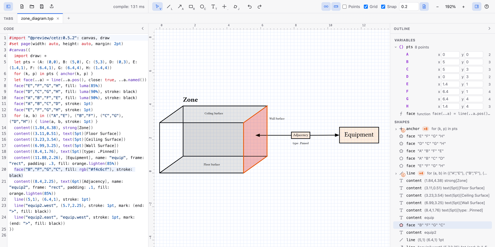

# CeTZ Editor

A canvas-style visual editor for [CeTZ](https://github.com/cetz-package/cetz)
diagrams that edits your hand-written Typst source in place. Everything runs
in the browser: the Typst compiler is compiled to WebAssembly, and there's no
backend.



## Features
- **Drag, draw and restyle on a canvas.** Every change is a minimal edit to the source.
- **Exact geometry from CeTZ itself.** Selection outlines, handles and anchors come from CeTZ's own computed shapes.
- **Code and canvas stay in sync.** Edit from either. Clicking a shape selects its call in the code, and putting the cursor in a call selects its shape. Undo covers edits from both.
- **Sync to a local file or export to SVG, PNG, PDF.**
- **Multipage support.** Support for CeTZ with multiple diagrams.

## Getting started

Requires Rust (with the `wasm32-unknown-unknown` target), `wasm-bindgen-cli`
0.2.129, Node and pnpm.

```bash
rustup target add wasm32-unknown-unknown
```

```bash
cargo install wasm-bindgen-cli --version 0.2.129 --locked
```

```bash
just setup
```

```bash
just dev
```

| Recipe | |
|---|---|
| `just dev` | Build the WASM modules and start the dev server |
| `just build` | Production build into `web/dist` |
| `just test` | Rust tests and a Svelte type-check |
| `just render` | For testing only. Render `fixtures/` to `generated/` with the Typst and LaTeX CLIs |

The first compile downloads CeTZ from packages.typst.org. After that it's
cached in the browser.

## Using it

See [USAGE.md](USAGE.md) for shortcuts, shared points, drawing with named
points, stacking, groups, the grid and the inspector.

## How it works

```
crates/scene/    Parses canvas bodies into draw calls with byte ranges; applies
                 edits (move, set coordinate/argument, connect, insert,
                 duplicate, delete) as minimal text patches; instruments
                 sources for the probe.
crates/compile/  In-memory Typst world: embedded fonts, packages added by the
                 host, SVG output, PDF/SVG/PNG export, and probe queries.
                 probe.typ wraps each CeTZ element to record its drawables,
                 anchors and transform.
crates/wasm/     Small bindings to `scene` used on the main thread.
crates/worker/   Bindings to `compile`, run in a Web Worker.
web/             Svelte 5 app: canvas, inspector, CodeMirror code pane.
```

The source text is the document. The scene model and the probe geometry are
both derived from it, keyed by each call's byte offset. An edit becomes text
patches, CodeMirror applies them as one undoable transaction, and everything
holding offsets is remapped through the patches until the next compile. While
you drag, the editor previews edits in the worker and shifts the overlay
natively, so it stays responsive when compiles lag.

## Limitations

- Targets **Typst 0.15.1 and CeTZ 0.5.2**. The probe depends on CeTZ's
  internal element structures.
- Only literal coordinates like `(1, 2)` get handles and move. Computed
  coordinates, relative coordinates (`(rel: ...)`) and lengths with units show
  in the preview, but you edit them in the code.
- Shapes created in loops share one call. Moving one moves every iteration.
- Elements passed straight into wrappers like `on-layer(1, content(...))` lose
  their name and anchors, and children of `hide({...})` can't be selected.
- New shapes are appended to the end of the active canvas.
- Rotating or scaling a shape from the canvas wraps it in
  `scope({ rotate(..); scale(..); shape })`. The scope keeps the shape's name
  usable from outside, and goes away again at 0° and 1×. Scaling doesn't
  change text or stroke widths.
- An open arc has no compass anchors (`"arc.north"`) in the editor, since CeTZ
  can't always find them. Polygon and star corners and edges are read off
  their outlines, as CeTZ 0.5.2's star can't compute its own.
- The compiler module is about 43 MB (17 MB gzipped), mostly embedded fonts.
