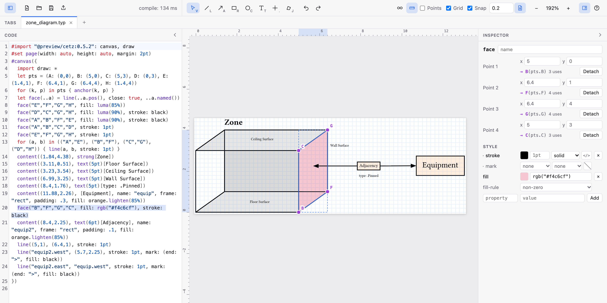

# Using CeTZ Editor

Press **?** in the app for a quick version of this guide.

## Shortcuts

| | |
|---|---|
| **V** / **L** / **A** / **R** / **C** / **T** | Select, line, arrow, rectangle, circle, text tools |
| **N** | Node: drag out a rounded rect with text on it, written as `rect(.., radius: 0.2, name: "node")` and `content("node", [Text])`, so the text follows the rect. The text opens ready to type |
| **E** | Connector: drag from one shape to another for an arrow between them, `elbow` (right-angled) or `straight`; press **E** again (or click the tool) to switch which. Drop on an anchor to use it, anywhere else on the shape to have one picked: an elbow leaves square to the side facing the other shape, a straight arrow from the nearest compass anchor. Unnamed shapes get a name. An elbow's corners are written from the two anchors (`("a.south", "\|-", ("a.south", 50%, "b.north"))`), so CeTZ re-routes it whenever either shape moves. When a side faces away from the other end (out of `a.south` to a shape above it), the elbow detours instead: each end steps out from its side (`(rel: (0, -0.5), to: "a.south")`) and the route joins those points. The inspector's **Step out** sets how far, for the selected detours and for every detour written after (0.5 to start with, remembered in this browser); so does dragging the dot where either end steps out, in grid steps (⌘: free). Moving shapes on the canvas switches between the two forms; drawing onto an anchor (rather than a shape's body) pins the connector, as dragging an end onto one does. The inspector's **Route** switches a selected connector between the two, re-picking its anchors; click the current route again to re-pick them after moving shapes. Drag the dot on a selected elbow's middle segment to move where it crosses over, in steps of 5% of the way between its ends (⌘: free); the percentage is written into both corners, so it still follows the shapes. The inspector's **Bend** sets it as a number, for several connectors at once too. Route puts it back halfway. Moving shapes (dragging, nudging, aligning) re-picks the sides of the connectors joined to them, keeping their bends, in the same undo step; the inspector's **Sides: Fixed** pins a connector's sides instead, with a `// cetz-editor: fixed` comment line above it. Drag a selected connector's start or end handle onto another shape to reconnect it, keeping its route and bend: dropped on an anchor, that end uses it and the connector is pinned; dropped on the shape anywhere else, sides are picked as for a new one; dropped on empty space, nothing changes. A connector drawn before its new shape moves to the end of the canvas, since CeTZ knows names in drawing order |
| **G** | Polygon: drag from the centre to a corner, which sets its size and rotation (`polygon((0, 0), 6, radius: 1)`) |
| **S** | Star: drag from the centre to an outer point, which sets its size and rotation (`n-star((0, 0), 5, radius: 1, angle: 54deg)`); a click makes one pointing up. Inner radius, points and more are in the inspector |
| **U** | Arc: drag from the centre to where it starts (or click both), then move to sweep it either way and click to finish |
| **.** | Named point: click to place one, then type its name |
| **B** | Brace: drag from start to end like a line, written as `decorations.brace(..)` |
| **Q** | Angle mark: click the corner, then a point on each side. It marks the inner angle (`angle.angle(..)`), or `angle.right-angle(..)` when the sides are square. Both tools add the library to your `#import "@preview/cetz:.."` line if it isn't there (or write `cetz.decorations.brace` under a bare import) |
| **K** | Curve through points: the join tool's clicks and snapping, written as a smooth `catmull(..)` |
| **J** | Join points: click points in turn; click the first again to close the shape, Enter or double-click to finish an open path, Esc to cancel |
| Click, Shift-click, drag on empty space | Select, add to selection, marquee select |
| Drag a shape | Move it (snaps its first point to the grid) |
| Drag a rect's other corners or its edges | Resize it: a corner moves parts of both written corners, an edge just one side (rects and grids whose two corners are literal coordinates) |
| Drag the square on a circle, polygon, star or arc | Set its radius (snapped to the grid step). Hold ⌥ on a circle's to stretch just that axis into an ellipse; an ellipse (`radius: (x, y)`) has a square per axis |
| Drag the round knobs on an arc's ends | Turn that end around the centre, keeping the other end put; writes whichever of `start`, `stop` and `delta` the arc uses (⇧: 15° steps). The start knob shows on arcs placed by their centre (`anchor: "origin"`, as the arc tool draws them) |
| Drag the knob off a selected group, scope or call to your own function's bottom-right corner | Scale it about its centre (or its rotation's pivot) in steps of 0.05 (⇧: quarters, ⌘: free). It goes in the same scope as a rotation, `scope({ rotate(..); scale(..); shape })`; back at 1 the `scale` goes, and the scope when nothing's left. Text and stroke widths don't scale. CeTZ's own shapes resize with their own handles instead, so they only get the knob once they're scaled, to change or undo it |
| Drag the knob above a selected shape | Rotate it (⇧: 15° steps, which include level and upright). Polygons, stars and text set their own `angle:`; anything else is wrapped once in `scope({ rotate(30deg, origin: ..) .. })` around its centre, and later turns edit that `rotate`; turning it back to 0° removes the scope again. Selecting the scope selects the shape: its handles, inspector and Ungroup work as before |
| ⌘-click a selected line or curve through points | Add a point there; ⌘-click one of its points to remove it (it keeps at least two, three when closed) |
| Drag a handle | Move that coordinate. Drop it on another shape's anchor to write `"name.anchor"` (the target is named if needed) |
| Double-click a group | Enter it to select its children (selecting one in the outline does too). Esc, or a click outside it, leaves |
| Double-click a shape drawn by your own function | Enter the function (see **Functions**) to select the shapes it draws |
| Double-click text | Edit it in place: its `[markup]` or string, as source. Enter saves (⇧Enter for a new line), Esc cancels, clicking away saves. The text tool (**T**) opens it straight away |
| Arrow keys (Shift: 1 unit) | Nudge by one grid step |
| ⌘D / Delete | Duplicate / delete |
| Align buttons (2+ shapes selected) | Line the shapes up by their bounds (left, centre, right, top, middle, bottom), or with 3+ space them evenly across or down; one undo step |
| ⌘C / ⌘X / ⌘V | Copy, cut, paste shapes as CeTZ source (paste it into any text editor, or paste CeTZ code from one onto the canvas). Pasting appends to the active canvas: back into the same drawing each paste steps by (0.5, -0.5) like ⌘D, after a cut or in another tab it lands in place. A name the drawing already uses becomes `name-2`, and the pasted code's references follow |
| ⌘G / ⇧⌘G | Group the selection / ungroup the selected groups |
| ⌘] / ⌘[ (Shift: all the way) | Bring forward / send backward |
| ⌘Z / ⇧⌘Z | Undo / redo, for canvas and code edits alike |
| ⌘O / ⌘S / ⇧⌘S | Open / save / save as. Saving writes back to the opened file in Chromium; other browsers download it |
| Export button (next to Save) | PDF, SVG, or PNG at 144 or 300 ppi, named after the file (`diagram.typ` → `diagram.pdf`). It's the whole document compiled as written, all pages stacked for SVG and PNG, the same as `typst compile` gives |
| Scroll / ⌘-scroll or pinch / Space-drag | Pan / zoom / pan |
| ⌘0, ⌘+, ⌘− | Fit, zoom in, zoom out |
| ⇧P | Show every shared point's marker |
| ⇧G / ⇧S | Toggle the grid / snapping to it |
| ⇧R | Toggle the rulers |
| ⇧I | Infinite canvas: hide the page edge, extend the grid everywhere, and keep the drawing still as an auto-sized page grows |
| ⌘\ | Show or hide the code panel (left). The inspector stays on the right |

**Shared points.** Points defined once and used by name are linked to their
definition: `let A = (0, 0)`, entries of `let pts = (A: ..., B: ...)`, and
CeTZ anchors (`anchor("A", (0, 0))`, or a `for (k, p) in pts { anchor(k, p) }`
loop). Dragging a shared corner, or a shape that uses one, edits the definition,
so every shape using it follows. Hold ⌥ while dragging to detach just that use
into its own coordinate (dropping it on another anchor reconnects it). The
inspector shows each corner's point (`→ A (pts.A)`) with a Detach button, and
a Share button turns a literal coordinate into a shared `anchor(...)`. New
anchors go at the top of the shape's block, after the anchors already there
(below any `rotate` or other transform the shape is under, since the
coordinate is in its frame), so every shape can use them and they don't pin
the shape's place in the stacking order. For anchors already scattered through
a file, right-click empty canvas for **Gather anchors at top**: each moves up
in its block, in order, until it reaches a transform or something it uses
(`anchor("C", "r.east")` stays below `r`). Hover a point to highlight the
shapes using it, and click its marker to select them.

**Drawing with named points.** While a drawing tool is active every named
point shows, and the start or end of a line, rect, circle or label snaps to
one and writes its name (`line("A", "G")`, `rect("E", "C")`) instead of
numbers. Handles snap to them the same way. The point tool (**.**) adds a
point to a dictionary an anchor loop names (`pts = (…, I: (3, 5.75))`), or
inserts `anchor("P1", (x, y))` with the other anchors at the top, and opens its name for
editing. Double-click a point's name in the outline to rename it everywhere
it's used by that name. The join tool (**J**) builds a path from points:
`line("A", "B", "G", close: true)`, snapping to named points and to other
shapes' anchors (an unnamed shape gets a name in the same undo step).

**Right-click menu.** Right-click anywhere on the canvas for what applies
there: on shapes, Duplicate, Group (two or more), Ungroup, Bring forward or
to front, Send backward or to back, and Delete (a shape outside the selection
becomes the selection); on a named point, Rename, Select shapes using it and
Delete; on empty canvas, Select all, Zoom to fit, Gather anchors at top and
the points and grid toggles; while joining, Finish, Close and Cancel.

**Editing a line's or curve's points.** Right-click a line, or a curve
through points (`catmull`, `hobby`), for **Add point here** (on the nearest
segment, or for a curve where the drawn curve passes; on the grid when
snapping), **Continue from start/end** and **Close/Open path**; right-click
one of its points to remove it or carry on from it. Quicker: with it
selected, ⌘-click (Ctrl-click) the path to add a point there, or one of its
points to remove it; the cursor shows + or − while ⌘ is held. With a line selected,
starting the join tool (a curve: the curve tool, **K**) on either end also
carries on from there: the new points go into the same call, and clicking the
other end closes it.

**Stacking.** CeTZ draws in code order, so what's in front is what comes later
in its block. ⌘] moves the selection's code past the next statement that
draws something, ⌘[ back past the previous one, and with Shift as far as it
can go. In the outline, which lists shapes in code order (top is drawn
first), drag a row to move it among the shapes in its block. A comment on the
lines above a shape, or after it on its line, moves with it. Nothing moves
past an `import`, a `set-style` or transform (that would change what it
applies to), or a shape it uses by name or that uses it (`"box.east"` must
come after `box`); the edit stops there, or refuses with a message. An anchor
or `let` it depends on, which draws nothing, comes along instead.

**Groups.** ⌘G (or Group in the inspector) wraps the selected shapes in
`group(name: "group", { ... })` where the first of them was, and anything
outside that used their names now goes through the group (`"box.east"` becomes
`"group.box.east"`). The shapes must be in the same block. A shape that's
further down moves up to join the group, unless it uses something defined in
between. ⇧⌘G puts a group's shapes back in its place and turns `"g.box.east"`
back into `"box.east"`. Either command refuses with a message, rather than
change the drawing, when a transform would stop or start applying to other
shapes, when something uses the group's own anchors (`"g.north"`), or when
names would clash.

**Functions.** A function the canvas draws with, like
`let plate(x) = { rect(..); content(..) }` used as `plate(4)`, gets its own
entry under Functions in the outline. It starts folded: open it to list the
calls in its body and how many times each is drawn. Double-click a use on the
canvas, or click the function in the outline, to enter it (which opens it): a
click then selects that shape in every copy, and the inspector edits the
function's code, so every copy changes.
Coordinates worked out from the function's parameters (`(x, 0)`) have no
handles and don't move by dragging; edit them in the inspector or the code.

**Grid step.** Type any size into the toolbar's grid field (`0.3`), a
fraction (`1/3`), or pick a preset. Snapping, the grid and the rulers all
follow it. It's kept in the file, as a comment on the line above each canvas
that Typst ignores:

```typst
// cetz-editor: grid 0.2
#canvas({ ... })
```

so a drawing opens with its own grid, and changing the step is an edit you
can undo. A canvas without the comment uses the default (0.2). The file
button next to the field turns this off: the comments are then ignored, and
the step is a view setting remembered in this browser, which also sets the
default.

**Smart guides.** Moving shapes, dragging a handle or drawing a shape lines
it up with the other shapes on the canvas: when its left, centre or right
(top, middle or bottom) comes within a few pixels of another shape's, it
snaps there and an orange guide shows the match. A guide wins over the grid
on its axis; the other axis still snaps to the grid. ⌘ turns both off.

**Snapping modifiers.** Hold **⇧** to lock line, arrow and join segments to
15° steps (lengths still snap to the grid along horizontal and vertical ones),
and the rotation handle to 15° steps.
Polygon and arc radii snap to the grid step and their angles to 15°.
Hold **⌘** (Ctrl elsewhere) to place without any snapping: no grid, points or
anchors. It works for every drawing tool, handle and move.

**Outline.** With nothing selected, the right panel shows the document:
**Variables** (every `let`; point variables and dictionaries of points are
editable here, other values show a summary and jump to the code) and
**Shapes** (every draw call). Calls in loops show how many shapes they drew
(`line ×4`) and expand into those repetitions, read-only and labelled by the
points they connect (`A → E`); hover or click one to highlight just it.
Text placed on a shape by its name, like a node's `content("node", [..])`,
is listed under that shape, wherever it is in the code.
Hover a shape or point and click its × to delete it, as Delete would; a
deleted point's other uses keep its position as coordinates.



The inspector lists every option the selected CeTZ function takes, set or
not, with CeTZ's default shown when unset (`close` and `mark` for lines,
`anchor`, `frame` and `padding` for content, `mode` for arcs, ...). Your own
functions that forward to a CeTZ one, like `let face(..a) = line(..a)`, get
that function's options. Values get fields: text size, color, bold, italic,
font and weight for `text(5pt)[...]`, `strong[...]` and the like; color,
thickness, dash, cap and join for `stroke`; start and end marks and their
size and placement; swatches for colors such as `luma(90%)` or
`orange.lighten(85%)`. Anything else, or any field after clicking `</>`, is
edited as a Typst expression. With several shapes selected it lists the
options they share, shows differing values as "mixed", and changing one part
of a stroke or mark keeps the rest of each shape's own value. Your last session is restored on reload, and you can
drop a `.typ` file on the window to open it. Hover the file name to see whether
Save writes back to the opened file. Browsers only reveal a picked file's name,
not its folder, so the full path can't be shown.
